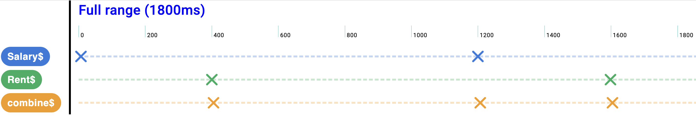

# RxVision

RxJS streams visualizer and debugger for Chrome DevTools and standalone use.<br>
Integrate it with your web application by marking emission points, and instantly inspect how your streams behave in real time inside DevTools.

---

## Demo usage

// TODO add demo video here

---

## Basic usage in your project

1. ~~Install the RxVision extension from the Chrome Web Store~~ – coming soon!  
   For now run:

   ```bash
   npm run build:extension
   ```

   This script compiles the extension into `chrome-devtools/dist/rxvis-extension` directory.

2. Navigate in Chrome browser to `chrome://extensions` – enable developer mode and load unpacked extension (pass `chrome-devtools/dist/rxvis-extension` directory).

3. Install the library with:

   ```bash
   npm install rx-vision
   ```
   or
   ```bash
   yarn add rx-vision
   ```
   depending on your package manager.

4. Mark observable's emission points in your code using the `addRxVisionEmission` function which takes 2 parameters:
    - `streamName: string` – unique identifier of the stream
    - `emissionValue: any` – value emitted

Example:

```ts
const streamName = 'A';

setTimeout(() => {
  addRxVisionEmission(streamName, 'value of first emission');
}, 1000);

setTimeout(() => {
  addRxVisionEmission(streamName, 'another value of emission');
}, 2000);

setTimeout(() => {
  addRxVisionEmission(streamName, { valueCanBe: 'object or any type!' });
}, 3000);
```

---

## Frontend development
Most of the time you want to develop in this mode.
This development mode allows you to work on RxVision UI and see changes in real time in the browser.
1. Clone this repository to your local machine
2. Make sure you have installed: <br> Python 3.11 or newer (you can check this running `python --version`) <br>
   Node.js 18 or newer (you can check this running `node --version`) <br>
   Angular CLI 17+ (you can install it running `npm install -g @angular/cli` and check version with `ng version`)
3. Run:
   ```bash
   npm run start:dev
   ```
4. Open http://localhost:4200 in a new browser tab
5. Any code modifications in `/frontend` directory will be automatically rebuilt and reflected in the browser.


## Chrome devtools development
This development mode allows you to check changes connected to chrome-devtools extension technicalities.
1. Follow steps 1-2 from [Frontend development](#frontend-development)
2. Run:
   ```bash
   npm run start:demo-app
   ```
3. Optionally - modify the source code before building the extension
4. On another console run:
   ```bash
   npm run build:extesion
   ```  
   This script compiles the extension into `chrome-devtools/dist/rxvis-extension` directory.
5. Navigate in Chrome browser to `chrome://extensions` – enable developer mode and load unpacked extension (pass `chrome-devtools/dist/rxvis-extension` directory).<br><br>
   If you've done this step before – just reload is enough.
6. Open http://localhost:4201 in a new browser tab
7. RxVision UI is available in Chrome DevTools (F12 → RxVision tab)
---

## Contributing
Contributions are welcome!
1. Fork this repository
2. Create a feature branch
3. Commit your changes
4. Open a pull request

---

## Issues & Support
- Found a bug? Please open an [issue](../../issues).
- Questions or suggestions? Feel free to reach out via GitHub Issues or Discussions.

---

## License
This project is licensed under the **MIT License** – see the [LICENSE](LICENSE) file for details.

---

## TODO / Planned improvements
- Documentation about Iframe usage
- IFrame tests - another demo-app this time with iframe
- Research about automatic applying of addRxVisionEmission (maybe AI is better now, before aider was the closes but no cigar).
- Stop button - to let the emissions be stopped from going to the extension
- Test on a 1000+ emissions and many streams (performance)

Bugs:
- Sometimes selecting range is buggy - there is 0 ms (maybe after we go back to Full range?)
- After long idle of web page and refreshing it - sometimes there are missing markers, maybe after changes of permissions in manifest

UI analysis/improvements:
- Dot lines of streams - maybe on the left split pane side too? Maybe different design?
- Maybe don't let left pane to be bigger than the longest stream name?
- Selecting markers - and displaying them in a right sidebar?
- Exporting data as JSON
- Importing data from JSON
- Exporting to Image/PDF
- Approach of not rerendering all markers components but only changing their positions when possible
- Stream based on different streams (with particular rxjs pipe)
- Dark mode (toggler && auto based on system theme or maybe time of day?)
- Ability to hide stream

## Project Structure

- **demo-app/**  
  *Realistic Angular app demonstrating RxVision end-to-end in devtools tab.*  
  Uses npm package from /api and expects the Chrome extension to be loaded.

- **chrome-devtools/**  
  *Chrome DevTools host & glue.*<br>
  It's build (npm run build) output is Chrome extension to be loaded in chrome browser *
  **No domain/UI logic resides here.**

- **frontend/**  
  *RxVision UI, domain and application logic.*
  *Can be run with ng serve for dev purposes.*

- **api/**  
  *Npm package* - https://www.npmjs.com/package/rx-vision <br>
  Stable API for sending emissions from user code to RxVision extension (as used in `demo-app`).  
  Contains pure js - no Angular or Chrome-specific code.

