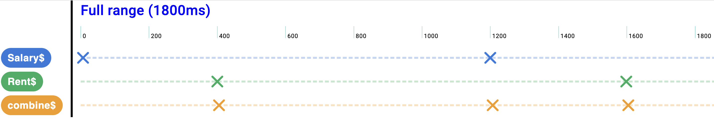

# RxVision

RxJS streams visualizer and debugger for Chrome DevTools and standalone use.<br>
Integrate it with your web application by marking emission points, and instantly inspect how your streams behave in real time inside DevTools.

---

## Gallery



## Video
Coming soon (demo video will be added here)


## StackBlitz demo

1. Make sure you have RxVision extension installed from [Chrome Web Store](https://chrome.google.com/webstore/detail/rxvision-rxjs-streams-v/ldgfbffkpkdmdmflfjdlnaclhkmjblmd)
2. Open [this StackBlitz demo project](https://stackblitz.com/edit/vitejs-vite-txfkgfrf?file=src%2Fmain.ts)
3. Open Chrome DevTools (F12) and navigate to RxVision tab
4. There you go! You can see emissions from the demo project in real time.

## Basic usage in your project

1. Make sure you have RxVision extension installed from [Chrome Web Store](https://chrome.google.com/webstore/detail/rxvision-rxjs-streams-v/ldgfbffkpkdmdmflfjdlnaclhkmjblmd)
2. Install the library in your project with:

   ```bash
   npm install rx-vision
   ```
   or
   ```bash
   yarn add rx-vision
   ```
   depending on your package manager.

3. Mark observable's emission points in your code using the `addRxVisionEmission` function which takes 2 parameters:
    - `streamName: string` – unique identifier of the stream
    - `emissionValue: any` – value emitted

Example:

```ts
const streamName = 'A';

setTimeout(() => {
  addRxVisionEmission(streamName, 'value of first emission');
}, 1000);

setTimeout(() => {
  addRxVisionEmission(streamName, 'another value of emission');
}, 2000);

setTimeout(() => {
  addRxVisionEmission(streamName, { valueCanBe: 'object or any type!' });
}, 3000);
```

---


## Contributing
Contributions are welcome!
1. Fork this repository
2. Create a feature branch
3. Commit your changes
4. Open a pull request
---

## Frontend development
Most of the time you want to develop in this mode.
This development mode allows you to work on RxVision UI and see changes in real time in the browser.
1. Clone this repository to your local machine
2. Make sure you have installed:
    - Python 3.11+ (`python --version`)
    - Node.js 18+ (`node --version`)
    - Angular CLI 17+ (`ng version`)
3. Run:
   ```bash
   npm run start:dev
   ```
4. Open http://localhost:4200 in a new browser tab
5. Any code modifications in `/frontend` directory will be automatically rebuilt and reflected in the browser.


## Chrome devtools development
This development mode allows you to check changes connected to chrome extension technicalities.
1. Follow steps 1-2 from [Frontend development](#frontend-development)
2. Run:
   ```bash
   npm run start:demo-app
   ```
3. Optionally - modify the source code before building the extension
4. On another console run:
   ```bash
   npm run build:extension
   ```  
   // TODO no longer
   This script compiles the extension into `chrome-devtools/dist/rxvis-extension` directory.
5. Navigate in Chrome browser to `chrome://extensions` – enable developer mode and load unpacked extension (pass `chrome-devtools/dist/rxvis-extension` directory).<br><br>
   If you've done this step before – just reload is enough.
6. Open http://localhost:4201 in a new browser tab
7. RxVision UI is available in Chrome DevTools (F12 → RxVision tab)
---


## Issues & Support
- Found a bug? Please open an [issue](../../issues).
- Questions or suggestions? Feel free to reach out via GitHub Issues or Discussions.

---

## License
This project is licensed under the **MIT License** – see the [LICENSE](LICENSE) file for details.

---

## Project Structure

- **demo-app/**  
  *Realistic Angular app demonstrating RxVision end-to-end in devtools tab.*  
  Uses npm package from /api and expects the Chrome extension to be loaded.

- **chrome-extension/**  
  *Chrome Extension host & glue.*<br>
  Its build (npm run build) output is Chrome extension to be loaded in chrome browser *
  **No domain/UI logic resides here.**

- **frontend/**  
  *RxVision UI, domain and application logic.*
  *Can be run with ng serve for dev purposes.*

- **api/**  
  *Npm package* - https://www.npmjs.com/package/rx-vision <br>
  Stable API for sending emissions from user code to RxVision extension (as used in `demo-app`).  
  Contains pure js - no Angular or Chrome-specific code.

